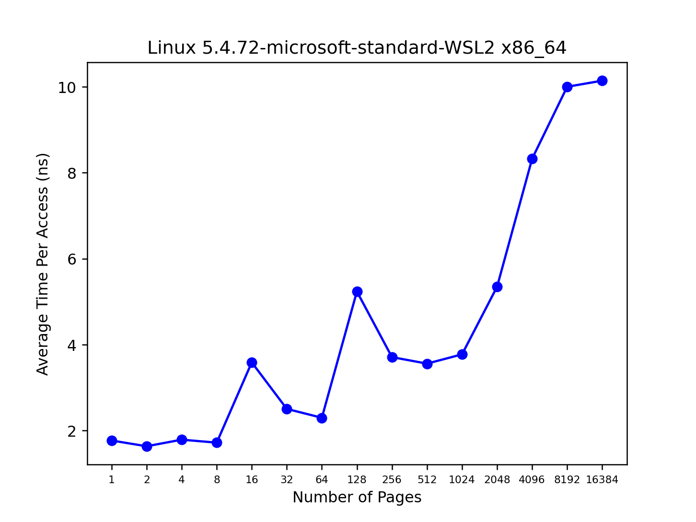

1. For timing, you’ll need to use a timer (e.g., gettimeofday()).
How precise is such a timer? How long does an operation have
to take in order for you to time it precisely? (this will help determine how many times, in a loop, you’ll have to repeat a page access
in order to time it successfully)

   - Call 
       ```
       clock_getres(CLOCK_PROCESS_CPUTIME_ID, &t)
       ```
       from 
       ```
       <time.h>
       ```


1. Write the program, called tlb.c, that can roughly measure the cost
of accessing each page. Inputs to the program should be: the number of pages to touch and the number of trials.

   - tlb.c
       ```c++
       #include <stdio.h> // printf, fprintf
       #include <unistd.h> // sysconf
       #include <stdlib.h> // exit
       #include <time.h> // clock_gettime

       int main(int argc, char *argv[]) { 
           if (argc < 3) { 
               fprintf(stderr, "usage: %s <pages> <trials> \n", argv[0]);
               exit(1);
           }

           int numPages = atoi(argv[1]);
           // number of trials (number of tiimes that we repeat the experiment)
           int numTrials = atoi(argv[2]);

           printf("numPages: %d\n", numPages);
           printf("numTrials: %d\n", numTrials);

           long PAGESIZE = sysconf(_SC_PAGESIZE); // 4096
           // how many ints are in a page
           long JUMP = PAGESIZE / sizeof(int); // 4096 / 8 = 1024
           
           // get precision
           struct timespec t;
           if (clock_getres(CLOCK_PROCESS_CPUTIME_ID, &t) == -1) { 
               fprintf(stderr, "clock_getres failed\n");
               exit(1);
           }
           printf("Precision of clock: %ld seconds, %ld nanoseconds\n", t.tv_sec, t.tv_nsec); // 1 nanosecond

           // array of pages
           int *arr = (int*)calloc(numPages, PAGESIZE);

           // save start time
           struct timespec start;
           if (clock_gettime(CLOCK_PROCESS_CPUTIME_ID, &start) == -1) { 
               fprintf(stderr, "clock_gettime failed\n");
               exit(1);
           }

           // run trials
           for (int i = 0; i < numTrials; ++i) { 
               // note that although we allocated for an array of "PAGESIZE"-sized elements
               // , we are really accessing the memory block as if it was an array of ints 
               // since the variable type is int*
               for (int j = 0; j < numPages * JUMP; j += JUMP) { 
                   arr[j] += 1;
               }
           }

           // save end time
           struct timespec end;
           if (clock_gettime(CLOCK_PROCESS_CPUTIME_ID, &end) == -1) { 
               fprintf(stderr, "clock_gettime failed\n");
               exit(1);
           }

           // average time over "numTrials" trials to make each access in nanoseconds
           printf("%f\n", ((end.tv_sec - start.tv_sec) * 1E9 + (end.tv_nsec - start.tv_nsec)) / (numTrials * numPages));
           free(arr); 

           return 0;
       }
       ```

1. Now write a script in your favorite scripting language (bash?) to
run this program, while varying the number of pages accessed from
1 up to a few thousand, perhaps incrementing by a factor of two
per iteration. Run the script on different machines and gather some
data. How many trials are needed to get reliable measurements?

   - We will use 100,000 trials.

1. Next, graph the results, making a graph that looks similar to the
one above. Use a good tool like ploticus or even zplot. Visualization usually makes the data much easier to digest; why do you
think that is?

   - The primary TLB seems to support around 8 pages. The secondary TLB seems to support atound 1024 pages. 
   - `python plot.py 15 100000 --single_cpu`
       

1. One thing to watch out for is compiler optimization. Compilers
do all sorts of clever things, including removing loops which increment values that no other part of the program subsequently uses.
How can you ensure the compiler does not remove the main loop
above from your TLB size estimator?
   - use the `-O0` tag


6. Another thing to watch out for is the fact that most systems today
ship with multiple CPUs, and each CPU, of course, has its own TLB
hierarchy. To really get good measurements, you have to run your
code on just one CPU, instead of letting the scheduler bounce it
from one CPU to the next. How can you do that? (hint: look up
“pinning a thread” on Google for some clues) What will happen if
you don’t do this, and the code moves from one CPU to the other?

   - Use `taskset` to bind a process to a certain processor.
     - or: 
     - `sched_setaffinity(2)` (for processes)
     - `pthread_setaffinity_np(3)` (for threads)
   - Without the `--single-cpu` option, the graph looks roughly the same.
   - 

1. Another issue that might arise relates to initialization. If you don’t
initialize the array a above before accessing it, the first time you
access it will be very expensive, due to initial access costs such as
demand zeroing. Will this affect your code and its timing? What
can you do to counterbalance these potential costs?

   - we can allocate the memory first and THEN start measuring the time