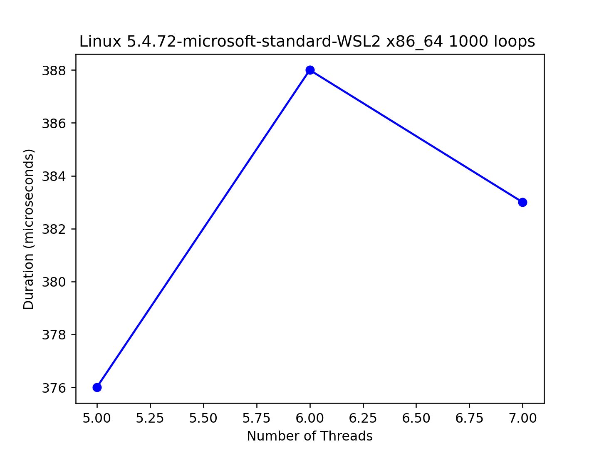

1. We’ll start by redoing the measurements within this chapter. Use
the call gettimeofday() to measure time within your program.
How accurate is this timer? What is the smallest interval it can measure? Gain confidence in its workings, as we will need it in all subsequent questions. You can also look into other timers, such as the
cycle counter available on x86 via the rdtsc instruction.
   -  Aapparently `gettimeofday` is accurate to a microsecond-ish
   -  But my `measure_accuracy.c` code says 0 microseconds

2. Now, build a simple concurrent counter and measure how long it
takes to increment the counter many times as the number of threads
increases. How many CPUs are available on the system you are
using? Does this number impact your measurements at all?

   - counter is in `simple_counter.c`
   - the plotting script is in `simple_counter_plot.py`
   - without cpu specification:
     - note that the duration fluctuates if the number of loops is small
       - e.g. `python3 simple_counter_plot.py 5 8 1 1000` 
       - e.g. `python3 simple_counter_plot.py 5 10 1 1000` 
       - e.g. `python3 simple_counter_plot.py 5 100 5 1000` 
     - when the number of loops is high, the trend is more predictable
       - e.g. `python3 simple_counter_plot.py 5 8 1 1000000` 
       - e.g. `python3 simple_counter_plot.py 5 10 1 1000000` 
       - e.g. `python3 simple_counter_plot.py 5 100 5 1000000` 
     - generally the trend is that as the number of loops incrase, the duration increases by about 15000 microseconds / 1 thread
   - running `lscpu` or `nproc`, I have 12 CPUs.
   - with cpu specification:
     - Adding more CPUs doesn't affect the duration in any predictable way for number of threads 5 - 100. It makes sense that increasing the number of CPUs doesn't do anything since we use one big lock for the counter, meaning while one CPU is updating the counter, the other CPUs just have to spin wait.
     - Interestingly, when we add more CPUs, the duration seems to be higher than that for just 1 CPU. This might be because if the program doesn't benefit from multi-CPU work, it performs worse since the CPUs have to interact with each other. 
     - It might also include the overhead of using `pthread_setaffinity_np`. In question 3, we see that as the number of CPUs increase, the duration only increases up to about 4 CPUs, after which the duration stays the same / decreases a little bit.   
     - `python3 simple_counter_plot.py 5 100 5 1000 -num_cpus=1` 
     - `python3 simple_counter_plot.py 5 100 5 1000 -num_cpus=2` 
     - `python3 simple_counter_plot.py 5 100 5 1000000 -num_cpus=1` 
     - `python3 simple_counter_plot.py 5 100 5 1000000 -num_cpus=2` 
     - `python3 simple_counter_plot.py 5 100 5 1000000 -num_cpus=12` 
    -  For threads 1-5, the same pattern holds.
     - `python3 simple_counter_plot.py 1 5 1 1000 -num_cpus=1` 
     - `python3 simple_counter_plot.py 1 5 1 1000 -num_cpus=2` 
     - `python3 simple_counter_plot.py 1 5 1 1000000 -num_cpus=1` 
     - `python3 simple_counter_plot.py 1 5 1 1000000 -num_cpus=2` 

3. Next, build a version of the sloppy counter. Once again, measure its
performance as the number of threads varies, as well as the threshold. Do the numbers match what you see in the chapter?
  - counter is in `approximate_counter.c`
  - the plotting script is in `simple_counter_plot.py`
  - we would expect the approximate counter to be faster than the precise counter for multi-CPU runs.
    - this is supported by the run: `python3 approximate_counter_plot.py 5 100 5 100000 -num_cpus=4` 
  - we would expect the approximate counter to be slower when only one CPU is available because the approximation optimization does nothing and there are the extra if-condition checks 
    - this is supported by the run: `python3 approximate_counter_plot.py 5 100 5 100000 -num_cpus=1` 
    - this is supported by the run: `python3 approximate_counter_plot.py 5 100 5 1000000 -num_cpus=1` 
  - The general pattern more or less matches the graphs in the book.
  - We would expect the approximate counter would get faster and faster as the number of CPUs increases (given there are enough threads to make use of the extra CPUs)
    - We see that there's an initial spike in duration from 1 to 2 CPUs. But from that point, the duration decreases for each CPU added but never as low as the duration at 1 CPU. 
    -  `python3 approximate_counter_plot.py 1 13 1 1000000 1024 20 -flip_threads_cpu=True` 

4. Build a version of a linked list that uses hand-over-hand locking
[MS04], as cited in the chapter. You should read the paper first
to understand how it works, and then implement it. Measure its
performance. When does a hand-over-hand list work better than a
standard list as shown in the chapter?

  - According to the chapter, hand-over-hand lists are rarely better than a standard list.
  - My code: `hand_over_hand_list.c`
    - the first argument: single character -> if 's', no multi-threading; else, every command runs on a different thread
    - the rest: single character starts the command: 
      - 'i': insert -> i {key} {position of newly inserted node}
      - 'd': delete -> d {position of node to delete} 
      - 'p': print -> p
  - A note: be careful with casting in C/C++. The compiler will let you cast, for example, `int` to `void**`, so a 4-byte variable to a 8-byte variable. If you edit the 8-byte variable, this might cause another local variable to change values unexpectedly.
    - I was doing:
    - ``` c++
        printf("number of threads: %d\n", thread_index);
        for (int i = 0; i < 3; ++i) { 
            int monkey;
            Pthread_join(*threads[i], (void**)&monkey);
            printf("i: %d, thread_index: %d\n", i, thread_index);
            printf("thread_exit: %ld\n", monkey);
        }
      ```
    - This kept changing `thread_index`
  - All of my thought proccesses are in the code file. 
  - TODO: time performance analysis